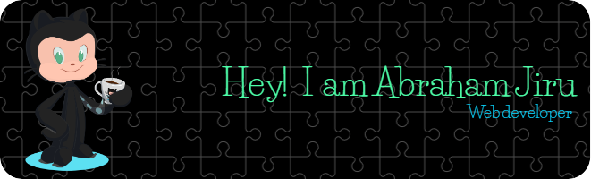

I have a passion for creating interactive and visually appealing websites, I've honed my skills to deliver high-quality projects that meet the needs of businesses and individuals alike.

My Github profile is where I showcase my projects, experiments, and contributions to the developer community. Whether you're a fellow developer looking for inspiration or a potential client interested in seeing my work, you'll find plenty of examples of my skills and experience here.

Feel free to take a look around and get in touch if you'd like to collaborate or have any questions. I'm always eager to learn and grow as a developer, and I'm excited to see where my journey takes me next!

# Languages and tools
[]
[]
[]
[]
[]
[]
[]
[]
[]
[]
[]
[]
[]

